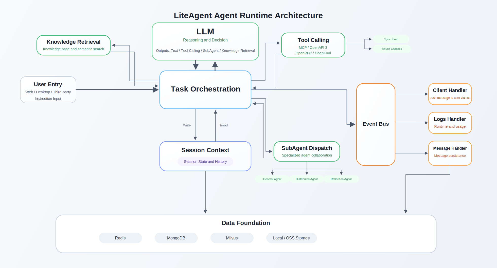

<div align="center">

# LiteAgent Backend

**An AI backend for multi-agent orchestration, knowledge retrieval, tool calling, and streaming chat**

English · [中文](README-zh_CN.md)

  
  
  
  
  
  
</div>

> LiteAgent Backend is a multi-module AI agent backend built with Spring Boot 3.5.4 and Java 17. It covers agent orchestration, SSE streaming chat, knowledge retrieval, plugin connectors, tool calling, file conversion, and external APIs.

## Quick Links

- [Highlights](#highlights)
- [Agent Runtime Flow](#agent-runtime-flow)
- [Tech Stack](#tech-stack)
- [Runtime Dependencies](#runtime-dependencies)
- [Quick Start](#quick-start)
- [Deployment](#deployment)
- [Related Docs](#related-docs)

## Highlights

| Capability | Description |
| --- | --- |
| Multi-Agent Orchestration | Supports planning, distribution, reflection, serial and parallel execution, and DAG task scheduling |
| Streaming Interaction | Outputs chat responses, tool events, and intermediate process data through SSE |
| Speech Capabilities | Supports speech-to-text, text-to-speech, and streaming audio APIs |
| Knowledge Retrieval | Document splitting, summaries, embeddings, Qdrant recall, and retrieval history |
| Tooling System | Supports OpenAPI3, JSON-RPC, MCP, OpenTool, and related protocols |
| Plugin Connectors | Connects third-party platforms to LiteAgent through plugins |
| File Processing | Supports upload, preview, signed access, Markdown conversion, and local/OSS storage |
| External Integration | Provides agent open APIs |

## Agent Runtime Flow

The diagram below summarizes how a LiteAgent request is completed across layers under the coordination of the scheduling layer.



## Tech Stack

| Category | Choice |
| --- | --- |
| Language | Java 17 |
| Framework | Spring Boot 3.5.4 |
| Web | Spring MVC + WebFlux |
| AI | Spring AI 1.1.2 |
| Database | MongoDB + Redis |
| Vector DB | Qdrant |
| Utility Library | Hutool 5.8.29 |
| Protocol Extensions | MCP SDK, OpenTool |
| Build | Maven |

## Runtime Dependencies

### Required

- JDK 17
- Maven 3.9+
- MongoDB 4.0+
- Redis
- Qdrant

### Optional

- SMTP mail service
  - Used for member invitations, verification codes, password recovery, and similar email scenarios
- Plugin Runner
  - Required when using plugin package execution and plugin distribution capabilities

## Quick Start

### 1. Prepare databases and base services

Prepare these databases and services:

- MongoDB: `lite-agent`

Make sure Redis, MongoDB, and [Qdrant](https://qdrant.tech/documentation/quick-start/) are reachable.

### 2. Update configuration

Configuration directory: [`lite-agent-rest/src/main/resources`](lite-agent-rest/src/main/resources)

### 3. Build the project

```bash
mvn clean package -DskipTests
```

Default build output:

- `lite-agent-rest/target/lite-agent-server.jar`

### 4. Start the service

```bash
java -jar lite-agent-rest/target/lite-agent-server.jar --spring.profiles.active=local
```

Main class:

- [`LiteAgentRestApplication.java`](lite-agent-rest/src/main/java/com/litevar/agent/rest/LiteAgentRestApplication.java)

## Deployment

### Docker Example

```bash
docker pull azul/zulu-openjdk:17-latest
docker run -d \
  --name lite-agent-server \
  -p 8080:8080 \
  -e TZ=Asia/Shanghai \
  -v /your/path/lite-agent-backend:/home/liteAgent \
  azul/zulu-openjdk:17-latest \
  java -jar \
  /home/liteAgent/lite-agent-server.jar \
  --spring.profiles.active=local
```

### Nginx SSE Example

```nginx
location /liteAgent/v1/chat/stream {
    proxy_set_header Connection "";
    proxy_buffering off;
    proxy_cache off;
    proxy_pass http://127.0.0.1:2205/liteAgent/v1/chat/stream;
}

location /liteAgent/v1/chat {
    proxy_set_header Connection "";
    proxy_buffering off;
    proxy_cache off;
    proxy_pass http://127.0.0.1:2205/liteAgent/v1/chat;
}
```

## Related Docs
- [plugin developer guide](docs/PLUGIN_DEVELOPER_GUIDE.md)

## Notice

Starting from `3.0.0`, LiteAgent Backend uses `Qdrant` instead of `Milvus` as the vector database.

If you need to migrate existing vector data, use:

- [`docs/milvus-qdrant-migrate`](docs/milvus-qdrant-migrate)
