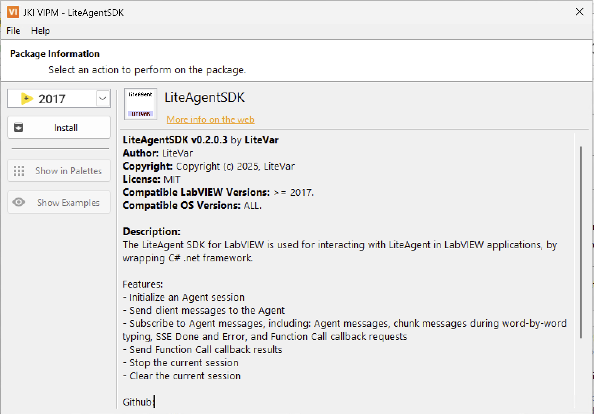
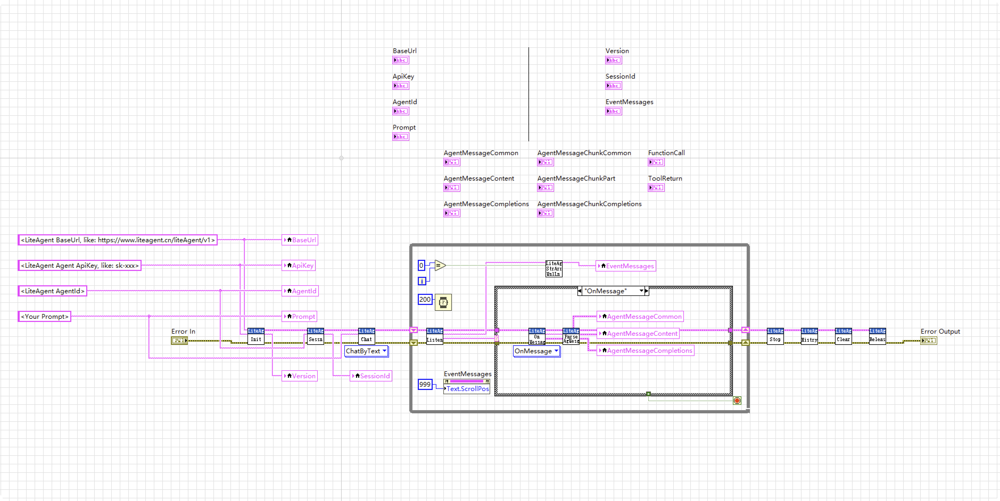

# LiteAgent SDK for LabVIEW

[English](README.md) · 中文

LiteAgent的LabVIEW SDK，用于LabVIEW应用程序中与LiteAgent进行交互。

## 功能

- 初始化Agent的会话
- 向Agent发送客户端消息
- 订阅Agent消息，包括：Agent消息、逐个吐字时的chunk消息、SSE的Done和Error、Function Call的回调请求
- 发送Function Call的Callback结果
- 停止当前会话
- 清除当前会话

## 安装

- 方法1：在`VIPM`搜索 `LiteAgentSDK`
- 方法2：如果`VIPM`没有搜索到，直接 [这里下载](https://github.com/LiteVar/LiteAgent/blob/master/lite_agent_sdk/labview/Build/) 最新版本的vip文件，双击打开

## 使用

- 详情可见：`/Example/Example.vi`

- 如果涉及第三方OpenTool，则需要重写 `/Example/Execute.vi`  并且返回你业务执行结果为ToolReturn

