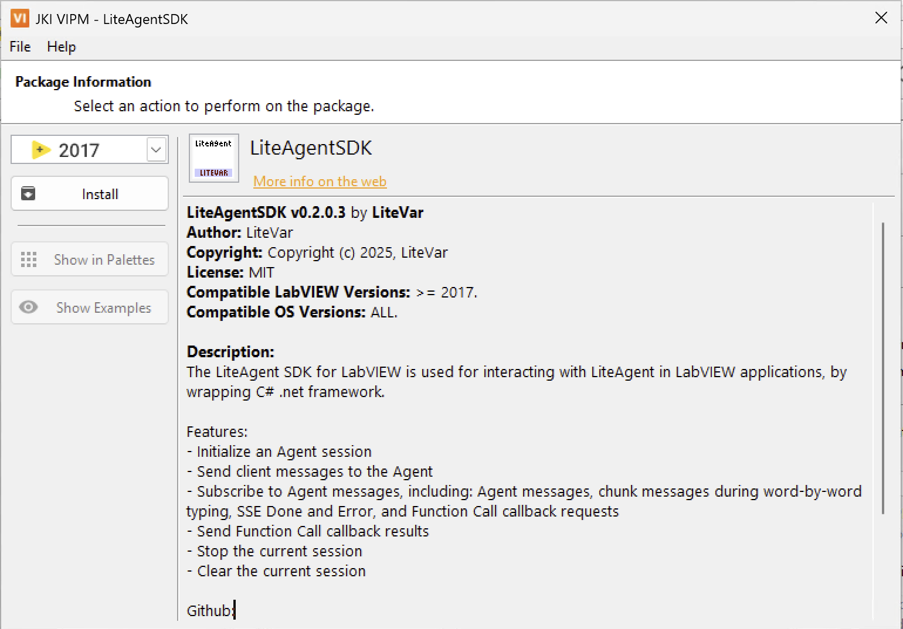
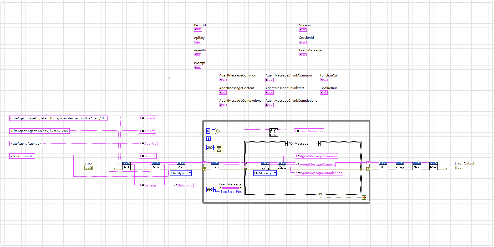

# LiteAgent SDK for LabVIEW

English · [中文](README-zh_CN.md)

The LiteAgent SDK for LabVIEW is used for interacting with LiteAgent in LabVIEW applications.

## Features

- Initialize an Agent session
- Send client messages to the Agent
- Subscribe to Agent messages, including: Agent messages, chunk messages during word-by-word typing, SSE Done and Error, and Function Call callback requests
- Send Function Call callback results
- Stop the current session
- Clear the current session

## Installation

- Method 1: From `VIPM` Search `LiteAgentSDK`
- Method 2: If `VIPM` does NOT find it, download the latest version of the `vip` file directly from [HERE](https://github.com/LiteVar/LiteAgent/blob/master/lite_agent_sdk/labview/Build/). 

## Usage

- See `/Example/Example.vi`

- Rewrite the `/Example/Execute.vi`  and return the ToolReturn
