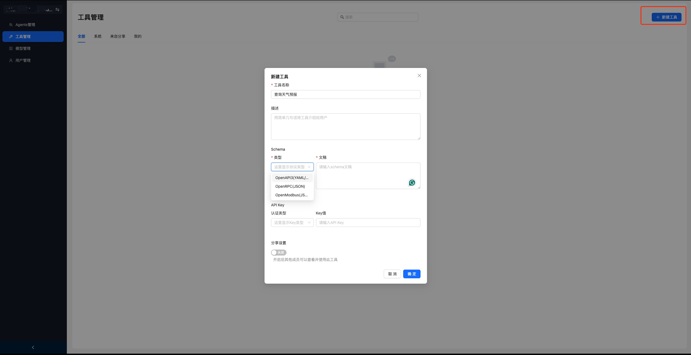

# Lite Agent Web

## Catalogue

- [Install](#Install)
- [Start](#Start)
- [Build](#Build)
- [Use](#Use)
- [Contribution](#Contribution)

## Install

After cloning the repository, run the following command to install the dependency:

```bash
npm install
```

## Start

### Generate the request interface file (if the back-end interface is updated and modified) Update the request interface file :/lib/lite_agent_openapi.json(such as the standard openapi3 specification)

Run the generate interface command:

```bash
npm run openapi-ts
```

### start server：

```bash
npm run dev
```

## Build

Compile project:

```bash
npm run build
```

Use the preview service provided by Vite:

```bash
npm run preview
```

## Other commands

### Lint checks and fixes

```bash
npm run lintFix
```

### API type generation

Generate OpenAPI type definitions:

```bash
npm run openapi-ts
```

---

## Use

### The system initializes and activates

The initialization page is displayed. Create the first user and activate the system.
The domain name + ` / init `, such as: http://localhost:5173/init


### After login, enter the the management background


### Add a new user


### Create Agent


### After the Agent is created, you need to create a model and configure the model parameters, such as:


### After the Agent is created, you can create a tool if necessary and configure model parameters, such as:


### Go to the Agent page and configure the Agent. (Model parameters are mandatory. Tools can be configured as required.) After the configuration is complete, click Save to release the agent


### Chat using Agent


---

## Contribution

We welcome community contributions! Please refer to [CONTRIBUTING.md](./CONTRIBUTING.md) for more information.

## Licence

This project is licensed under the MIT LICENSE, see the license file for details.

---

Thank you for your interest and support in the Lite Agent Web project! If you have any questions or suggestions, please submit feedback via Issue.
