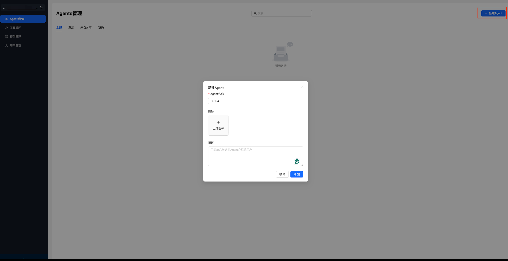
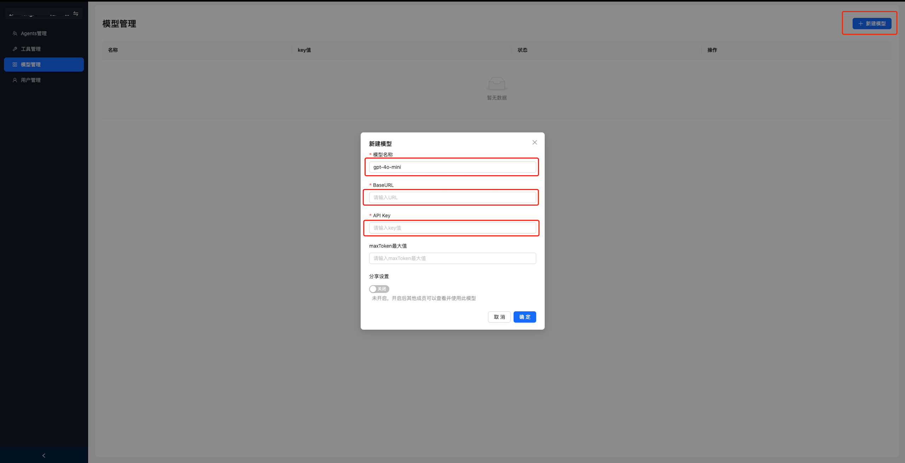
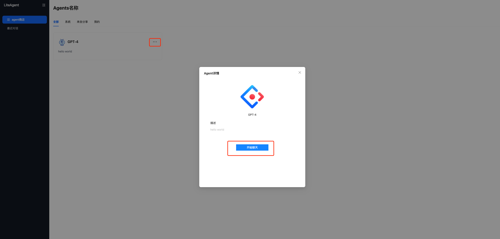

# Lite Agent Web

## 目录

- [安装](#安装)
- [启动](#启动)
- [构建](#构建)
- [使用](#使用)
- [贡献](#贡献)

## 安装

在克隆仓库后，运行以下命令以安装依赖：

```bash
npm install
```

## 启动

### 生成请求接口文件(如后端接口有更新修改，无修改可忽略)更新请求接口文件:/lib/lite_agent_openapi.json(如标准的openapi3规范)

执行生成接口命令:

```bash
npm run openapi-ts
```

### 启动开发服务器：

```bash
npm run dev
```

## 构建

编译项目：

```bash
npm run build
```

使用 Vite 提供的预览服务：

```bash
npm run preview
```

## 其他命令

### Lint 检查和修复

```bash
npm run lintFix
```

### API 类型生成

生成 OpenAPI 类型定义：

```bash
npm run openapi-ts
```

---

## 使用

### 系统初始化激活

进入初始化页面，创建第一个用户，激活系统。
域名 + `/init`，如：http://localhost:5173/init


### 登录后进入管理后台页面


### 添加新用户


### 创建Agent


### 创建Agent后需要创建模型，并配置模型参数，如：


### 创建Agent后如有需要可创建工具，并配置模型参数，如：


### 进入Agent页面进行配置Agent(模型参数必填，工具可按需配置)配置完成后，点击保存，发布即可


### 使用Agent进行聊天



---

## 贡献

我们欢迎社区贡献！请参考 [CONTRIBUTING.md](./CONTRIBUTING.md) 获取更多信息。

## 许可证

本项目采用 MIT 许可证，详情请参阅 LICENSE 文件。

---

感谢您对 Lite Agent Web 项目的关注和支持！如有任何问题或建议，请通过 Issue 提交反馈。
